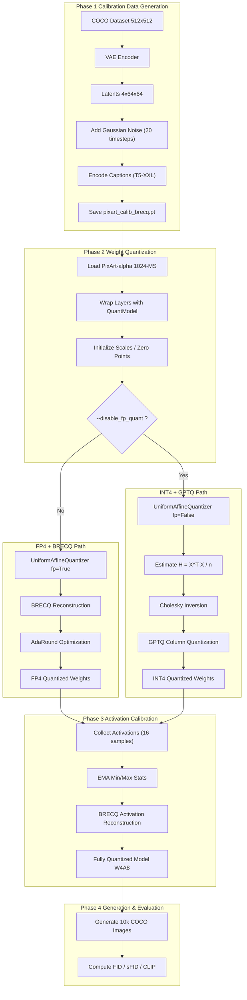

# Empirical Study of Integer vs Float PTQ for DiTs

This repository is the PixArt-alpha-only split used for our project:
an empirical comparison of integer PTQ and low-bit floating-point PTQ for diffusion transformers.

## Problem Scope
We evaluate whether low-precision floating-point PTQ preserves DiT generation quality better than integer PTQ under equal bit budgets:
- `W4A6`
- `W4A8`

Target models and data:
- PixArt-alpha
- MS-COCO prompts/images for calibration and evaluation

## Related Methods
- Q-DiT: integer PTQ baseline with group quantization and dynamic quantization.
- FP4DiT: floating-point PTQ with module-aware precision and scale-aware rounding.


## Mind Map



## Progress So Far
Completed on Q-DiT side:
- Calibration data collection pipeline
- Quantization and generation pipeline
- Evaluation pipeline for IS/FID/sFID/Precision/Recall


## Running FP4DiT in This Repo
### 1) Environment
Use `requirements-uv.txt` (recommended for this split):
```bash
uv venv -p 3.9
source .venv/bin/activate
uv pip install --index-url https://download.pytorch.org/whl/cu117 torch==1.13.1+cu117 torchvision==0.14.1+cu117 torchaudio==0.13.1
uv pip install --index-strategy unsafe-best-match -r requirements-uv.txt
```

### 2) Data
Calibration script expects COCO at:
- default: `~/datasets/coco`
- override: `COCO_ROOT=/path/to/coco`

Expected files:
- `train2017/`
- `annotations/captions_train2017.json`

Download commands (matches the hardcoded layout used by `scripts/pixart_alpha_calib.py`):
```bash
export COCO_ROOT=~/datasets/coco
mkdir -p "$COCO_ROOT"
cd "$COCO_ROOT"

wget -c http://images.cocodataset.org/zips/train2017.zip
wget -c http://images.cocodataset.org/annotations/annotations_trainval2017.zip

unzip -q train2017.zip
unzip -q annotations_trainval2017.zip
```

If you run generation with `--coco_10k` or `--coco_9k`, this repo also expects:
- `captions/captions_val2017.json`

Create it from COCO annotations:
```bash
cd /path/to/DIT-PTQ
mkdir -p captions
cp "$COCO_ROOT/annotations/captions_val2017.json" captions/captions_val2017.json
```

### 3) Generate Calibration Data
```bash
python scripts/pixart_alpha_calib.py
```
This creates `pixart_calib_brecq.pt`.

### 4) Quantize + Generate
```bash
python scripts/pixart_alpha_brecq.py --plms --cond --n_samples 1 --outdir <output_dir> --ptq --weight_bit 4 --quant_mode qdiff --cali_data_path pixart_calib_brecq.pt --cali_batch_size 16 --cali_iters 2500 --cali_iters_a 1 --quant_act --act_bit <6_or_8> --act_mantissa_bits <3_for_A6_or_4_for_A8> --weight_group_size 128 --weight_mantissa_bits 1 --ff_weight_mantissa 0 --res 512 --coco_10k
```

### 5) Resume from Existing Checkpoint
```bash
python scripts/pixart_alpha_brecq.py --plms --cond --n_samples 1 --outdir <output_dir> --ptq --weight_bit 4 --quant_mode qdiff --cali_data_path pixart_calib_brecq.pt --cali_batch_size 16 --cali_iters 2500 --cali_iters_a 1 --quant_act --act_bit <6_or_8> --act_mantissa_bits <3_for_A6_or_4_for_A8> --cali_ckpt <ckpt> --resume_w --weight_group_size 128 --weight_mantissa_bits 1 --ff_weight_mantissa 0 --res 512 --coco_10k
```

### 6) Evaluate (FID / sFID / CLIP-score)
After generation, run:
```bash
python scripts/eval_metrics.py \
  --gen_dir <output_dir>/<run_timestamp>/samples_10k \
  --real_dir "$COCO_ROOT/val2017" \
  --captions_json captions/captions_val2017.json \
  --caption_mode coco_10k \
  --save_json <output_dir>/<run_timestamp>/metrics.json
```

Notes:
- `--caption_mode coco_10k` matches generation with `--coco_10k`.
- For `--coco_9k`, use `--caption_mode coco_9k` and `samples_9k`.
- CLIP-score prompt source can also be `--prompt_file` (one prompt/line) or `--prompt` (single prompt for all images).
- `sFID` here is computed from Inception-v3 `Mixed_6e` spatial features (patch-level statistics), while `FID` uses global pooled Inception features.
